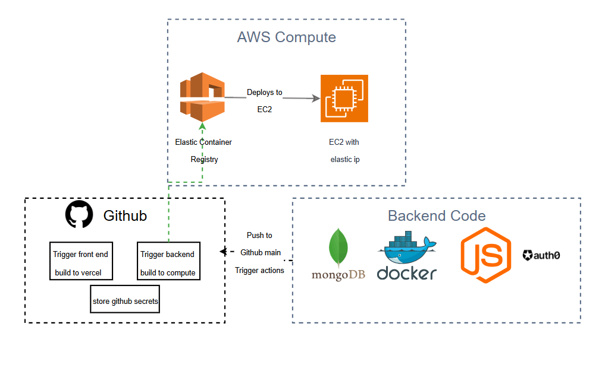

# Cargo Connect - Infrastructure Repository (Minimal Backend)



This repository contains the Terraform code for provisioning and managing the minimal cloud infrastructure for the Cargo Connect backend application. It uses a modular approach with environment separation, focusing on provisioning an EC2 instance ready for container deployment via CI/CD.

# Repository Structure

The repository is organized as follows:

```
cargo-connect-infra/
├── .gitignore        # Standard Terraform ignores
├── environments/     # Root modules for each deployment environment
│   └── dev/          # Configuration for the 'dev' environment
│       ├── backend.tf      # Backend config for dev state
│       ├── terraform.tfvars      # Variable values for dev (gitignored)
│       ├── main.tf         # Calls modules for dev environment
│       ├── outputs.tf      # Outputs specific to dev environment
│       ├── providers.tf    # Provider configs for dev
│       └── variables.tf    # Variable definitions for dev environment
│   # (staging/, prod/ directories would follow the same pattern)
└── modules/          # Reusable infrastructure modules
    ├── aws_compute/      # AWS Compute (ECR, EC2, IAM, SG, EIP)
    │   ├── main.tf
    │   ├── outputs.tf
    │   └── variables.tf
    └── aws_network/      # AWS Networking (VPC, Subnets)
        ├── main.tf
        ├── outputs.tf
        └── variables.tf
```

*   **`environments/`**: Contains one subdirectory per deployment environment (e.g., `dev`, `staging`, `prod`). Each environment directory is a Terraform root module. You run `terraform` commands from within these directories.
*   **`modules/`**: Contains reusable Terraform modules that define specific parts of the infrastructure (networking, compute). These modules are called by the `main.tf` within each environment directory.

## Prerequisites

1.  **Terraform CLI:** Install the Terraform CLI (version >= 1.0).
2.  **AWS Credentials:** Configure AWS credentials locally (e.g., via environment variables `AWS_ACCESS_KEY_ID`, `AWS_SECRET_ACCESS_KEY`, `AWS_SESSION_TOKEN`, or via AWS profiles). The credentials need permissions to create/manage the resources defined in the modules (VPC, EC2, ECR, IAM roles/policies, S3/DynamoDB for Terraform backend, potentially SSM).
3.  **Terraform Backend:** Manually create the S3 bucket (`terraform-state-cargo-connect` or your chosen name) and DynamoDB table (`terraform-lock-cargo-connect` or your chosen name) in your desired AWS region (`us-east-1` by default) before the first run. Ensure the AWS credentials used by Terraform have permissions to access this bucket and table. [See steps.md](steps.md)
4.  **EC2 Key Pair:** Ensure you have an EC2 Key Pair created in the target AWS region.

## Provisioning an Environment (Example: dev)

1.  **Navigate to Environment Directory:**
    ```bash
    cd environments/dev
    ```
2.  **Prepare Variables:**
    *   Edit `terraform.tfvars`.
    *   Fill in the required values, especially `ec2_key_name`.
    *   For `allowed_ssh_cidr_blocks`, the `dev` environment currently uses `["0.0.0.0/0"]` for easier access (accepting the security risk), but **it is strongly recommended to restrict this to specific IP addresses (e.g., `["YOUR_IP/32"]`) for staging/production environments.**
    *   *(No sensitive variables required for this minimal setup unless added later)*
3.  **Initialize Terraform:**
    ```bash
    terraform init
    ```
    This downloads providers and initializes the backend.
4.  **Plan Changes:**
    ```bash
    terraform plan
    ```
    Review the planned actions.
5.  **Apply Changes:**
    ```bash
    terraform apply
    ```
    Confirm the prompt by typing `yes`. This provisions the infrastructure, including the EC2 instance with Docker installed, but **does not deploy the application container**.

Repeat these steps for other environments (staging, prod) by creating corresponding directories and `.tfvars` files under `environments/`.

## Variable Management

*   Variables for each environment are defined in `environments/<env>/variables.tf`.
*   Non-sensitive, environment-specific values are provided in `environments/<env>/terraform.tfvars`.
*   **Sensitive values** (if added later) **MUST** be provided via environment variables prefixed with `TF_VAR_`.

*Note: Application deployment (Docker pull/run on EC2) is triggered by the GitHub Actions workflow, after Terraform provisions the base infrastructure. The workflow's `docker run` command needs to map the container port only to the host's loopback interface (e.g., `-p 127.0.0.1:8000:8000`) so Nginx can proxy to it.*

## Accessing the Endpoint

*   The backend is accessible via HTTPS on the EC2 instance's public IP: `https://<EC2_PUBLIC_IP>`.
*   **Certificate Warning:** Because a self-signed certificate is used (for free-tier compatibility without a custom domain), you **will** receive security warnings in browsers and API clients. You must explicitly choose to bypass these warnings (e.g., "Proceed to unsafe", `curl -k`) for testing and internal use.

## Maintenance

*   To modify infrastructure for an environment, make changes to the variables in the corresponding `terraform.tfvars` file or update resource configurations within the relevant `modules/` directory.
*   Navigate to the environment directory (`cd environments/<env>`).
*   Run `terraform plan` to review changes.
*   Run `terraform apply` to apply changes.
*   Application updates are handled via the CI/CD pipeline in the application repository (`cargo-connect-backend`).

## Modules Overview

*   **`aws_network`**: Creates the VPC, public/private subnets, NAT Gateway/Internet Gateway.
*   **`aws_compute`**: Creates the ECR repository, EC2 instance (bootstrapped with Docker, AWS CLI, Nginx, and a self-signed TLS certificate for HTTPS), IAM role/profile, Security Group (allowing HTTP/HTTPS/SSH), and Elastic IP. Nginx acts as a reverse proxy for the application container.

**For a comprehensive, step-by-step guide covering initial cloud setup, CI/CD configuration, and deployment, please refer to the [Deployment Guide (steps.md)](steps.md).**


# Infrastructure Resource Choices & Trade-offs

### 1. Introduction

This section outlines the resource selection process for the Minimum Viable Product (MVP) backend infrastructure. The primary goals guiding these decisions were:

*   **Functionality:** Deliver a working backend endpoint for internal use.
*   **Cost Efficiency:** Maximize the use of the AWS Free Tier to minimize costs for this unfunded project.
*   **Simplicity:** Choose solutions suitable for an MVP and a coding camp context.
*   **Constraint:** Operate without purchasing or using a custom domain name.

### 2. Detailed Breakdown by Use Case

#### 2.1 Frontend Deployment

*   **Chosen Approach:** Vercel
*   **Alternatives Considered:** AWS Amplify, EC2 + CDN (CloudFront), Fargate + ALB + CloudFront.
*   **Reasoning:**
    *   **Free Tier:** Vercel offers a generous free tier suitable for hobby projects and MVPs, including hosting, CDN, and CI/CD integration.
    *   **Simplicity:** Vercel provides a very streamlined developer experience for deploying frontend frameworks like Next.js, integrating directly with GitHub.
    *   **Focus:** Allows the team to focus on frontend development without managing underlying infrastructure. AWS alternatives, while powerful, often involve more configuration overhead and potential costs outside the free tier (especially data transfer).

#### 2.2 Backend Deployment

*   **Chosen Approach:** Single EC2 Instance (t2.micro/t3.micro) in Public Subnet + Docker Container
*   **Alternatives Considered:**
    *   EC2 Instance in Private Subnet + ALB (Application Load Balancer)
    *   AWS Fargate + ALB
    *   AWS App Runner
    *   AWS Lambda + API Gateway
*   **Reasoning:**
    *   **Free Tier:** AWS provides 750 hours/month of a t2.micro (or t3.micro depending on region/availability) instance, fitting within the free tier.
    *   **Simplicity (for MVP):** Deploying a container on a single EC2 instance is conceptually straightforward for basic needs. The `user_data` script handles initial setup.
    *   **Cost:** Avoids the cost of an Application Load Balancer, which is *not* included in the permanent free tier and would be the primary cost driver for the private subnet/Fargate options. While Fargate/App Runner/Lambda have free tiers, combining them with necessary networking (like NAT Gateway for Fargate/Lambda in private subnets or the implicit load balancing in App Runner) can sometimes exceed free limits or add complexity not needed for this internal MVP.
    *   **Public Subnet:** Placing the instance in the public subnet with an Elastic IP avoids the need for a load balancer, directly aligning with the free-tier goal for this specific use case. Security is managed via Security Groups.

#### 2.3 Artifact Registry

*   **Chosen Approach:** AWS Elastic Container Registry (ECR)
*   **Alternatives Considered:** Docker Hub, GitHub Container Registry (GHCR).
*   **Reasoning:**
    *   **Free Tier:** ECR offers 500 MB/month of storage for private repositories in its free tier, sufficient for an MVP.
    *   **Integration:** Seamlessly integrates with AWS services like EC2 IAM roles for secure, easy authentication to pull images without managing separate credentials.
    *   **Proximity:** Keeps artifacts close to the deployment environment (EC2). Docker Hub has pull rate limits for free users, and while GHCR is a good option, ECR's IAM integration is slightly simpler within an AWS-centric deployment.

#### 2.4 Version Control

*   **Chosen Approach:** GitHub
*   **Alternatives Considered:** AWS CodeCommit, GitLab, Bitbucket.
*   **Reasoning:**
    *   **Free Tier:** GitHub offers free private repositories with generous limits.
    *   **Familiarity:** Widely used and familiar to most developers/students.
    *   **Ecosystem:** Excellent integration with CI/CD tools (GitHub Actions) and services like Vercel. AWS CodeCommit is free but less commonly used outside AWS-heavy teams.

#### 2.5 Secrets Management

*   **Chosen Approach:** GitHub Secrets (for CI/CD) / Environment Variables (in EC2)
*   **Alternatives Considered:** AWS Secrets Manager, AWS Systems Manager Parameter Store, HashiCorp Vault.
*   **Reasoning:**
    *   **Free Tier:** GitHub Secrets are free for use in GitHub Actions workflows (e.g., passing AWS credentials for ECR push). Injecting secrets into the EC2 instance via environment variables during `user_data` or manually is free.
    *   **Simplicity (for MVP):** Avoids the cost and configuration overhead of AWS Secrets Manager (which has costs beyond the free trial) or Parameter Store (standard parameters are free but require IAM setup). For an internal MVP with limited secrets, environment variables are often sufficient.
    *   **CI/CD Integration:** GitHub Secrets are the native solution for GitHub Actions.

#### 2.6 Mapping Service API

*   **Chosen Approach:** Mapbox
*   **Alternatives Considered:** Google Maps Platform, OpenStreetMap providers.
*   **Reasoning:**
    *   **Free Tier:** Mapbox typically offers a usable free tier for map loads/API calls suitable for development and low-traffic MVPs.
    *   **Functionality:** Provides the required mapping features. (Assumed based on initial diagram/context). Google Maps Platform also has a free tier but sometimes requires billing setup.

#### 2.7 HTTPS (Security)

*   **Chosen Approach:** Self-Signed Certificate on EC2 Instance + Reverse Proxy (Nginx/Caddy)
*   **Alternatives Considered:**
    *   AWS CloudFront + AWS Certificate Manager (ACM)
    *   Let's Encrypt Certificate on EC2 Instance
    *   HTTP Only (No Encryption)
*   **Reasoning:**
    *   **No Custom Domain Constraint:** This is the deciding factor. Both ACM and Let's Encrypt *require* a custom domain you control to issue publicly trusted certificates. Since no domain is available, these options are not feasible.
    *   **Free Tier:** Generating a self-signed certificate and running Nginx/Caddy on the existing free-tier EC2 instance incurs no additional AWS cost. CloudFront has a free tier, but requires ACM, which requires a domain.
    *   **Provides Encryption:** Achieves the goal of encrypting traffic, even if it's not publicly trusted.
    *   **Internal Use Case:** The primary drawback is browser/client trust warnings. For an internal tool used by students who can be instructed to bypass these warnings, this is an acceptable trade-off for an unfunded MVP. Using plain HTTP is insecure.

## 3. Summary Table

| Use Case             | Chosen Approach                                       | Key Alternatives Considered                     | Choice Reason                                                                                                |
| :------------------- | :---------------------------------------------------- | :---------------------------------------------- | :----------------------------------------------------------------------------------------------------------- |
| Frontend Deployment  | Vercel                                                | EC2+CDN, Amplify, Fargate+ALB                 | Excellent free tier, simplicity, focus on frontend dev.                                                      |
| Backend Deployment   | EC2 (t2/t3.micro) in Public Subnet + Docker           | EC2 (Private)+ALB, Fargate+ALB, App Runner    | Maximizes EC2 free tier, avoids ALB cost, simple for MVP.                                                    |
| Artifact Registry    | AWS ECR                                               | Docker Hub, GHCR                                | Free tier storage, seamless AWS IAM integration for EC2 pulls.                                               |
| Version Control      | GitHub                                                | CodeCommit, GitLab                              | Free private repos, developer familiarity, ecosystem integration.                                            |
| Secrets Management   | GitHub Secrets (CI/CD) / Env Vars (EC2)               | AWS Secrets Manager, Parameter Store            | Free, simple for MVP needs, integrates with GitHub Actions.                                                  |
| Mapping Service API  | Mapbox                                                | Google Maps, OpenStreetMap                    | Assumed functional requirement, offers a usable free tier.                                                   |
| HTTPS (Security)     | Self-Signed Certificate + Reverse Proxy (Nginx/Caddy) | CloudFront+ACM, Let's Encrypt (needs domain) | **No Custom Domain available.** Provides encryption within free tier; trust warnings acceptable for internal use. |


