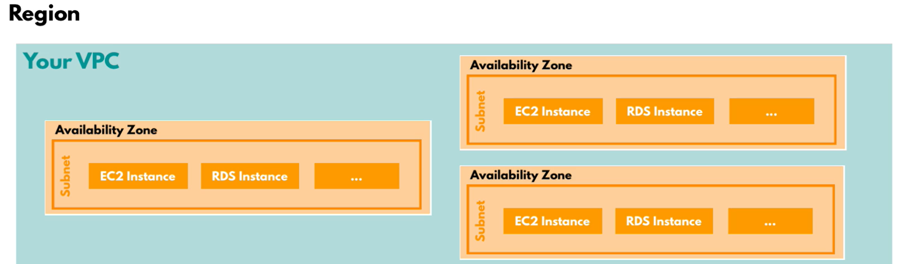

# VPC: Virtual Private Cloud - 
A virtual representation of a network that you can use to deploy and manage your AWS resources. The VPC spans the overall region. creating a virtual provate cloud is important to...it consists of subnets, ip address range, and security groups.

### Subnets:
sub componets of the vpc where the resources will be hosted, spanning the availabilty zones of the region. 

Private and public subnets. Usinf firewall configuration to control access to the resources. 

Private subnets: if application is not exposed to the internet, use private subnets

Public subnets: If application is exposed to the internet, use public subnets

### NAT Gateway:

### Internet Gateway:
Connects the VPC to the outside internet

### Security Groups:

### Firewall
